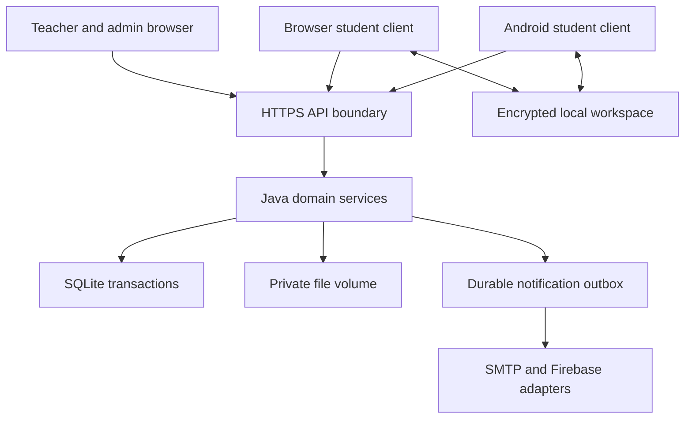
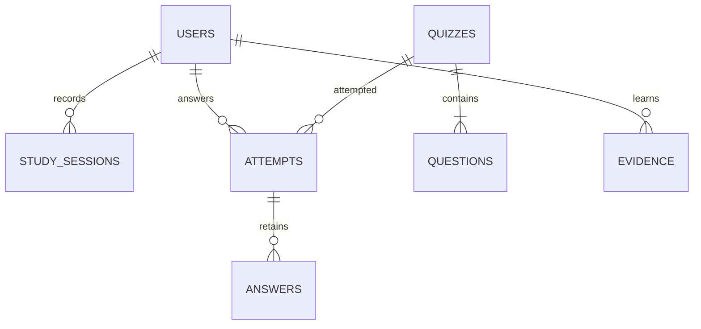
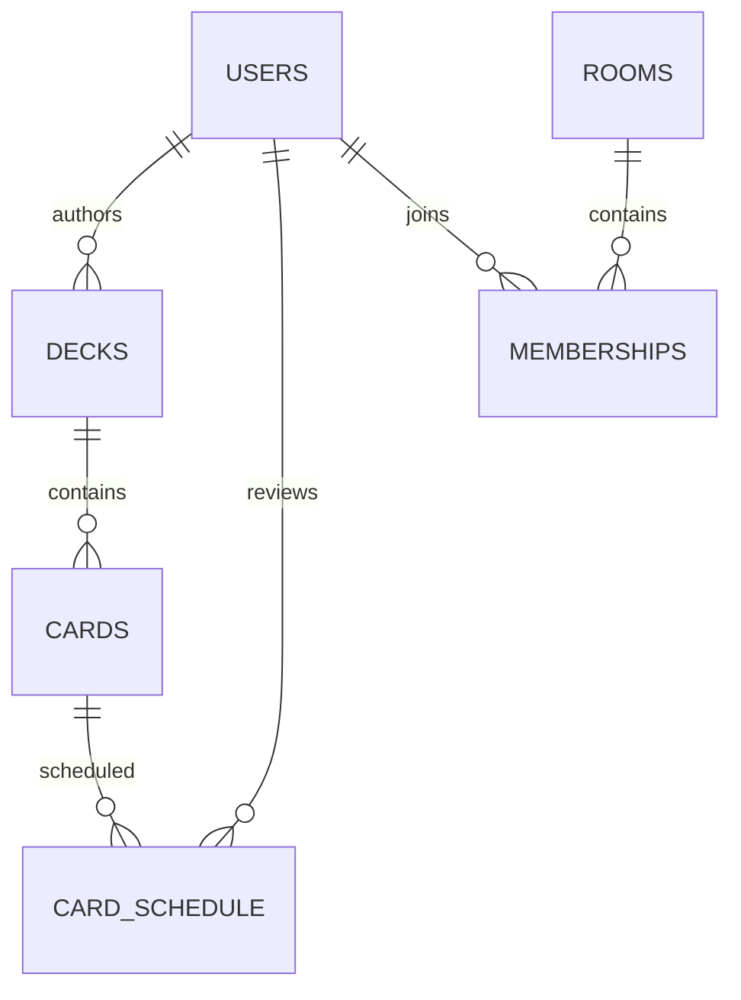
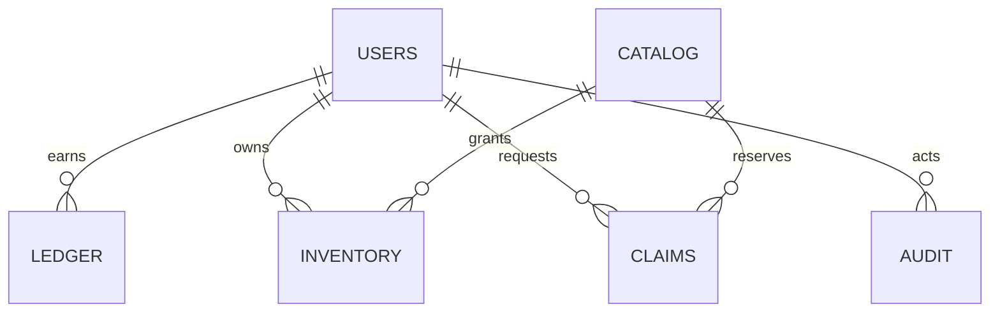

# Study Arena — Part 2: Architecture and data model

**Release:** Capstone MVP and controlled pilots. **Stack decision:** Java backend and JavaScript client, following the user's latest direction. **Team:** 1–2 beginner developers; 4–6 weeks. This document accompanies the executable code, not a proposed mock application.

## 1. Scope carried forward

The survey is small (15 respondents) but determines the priorities: solo-first study; opt-in competition; same-band peers; personal topic progress rather than public rank; deterministic cosmetics and useful study rewards. Competition is never needed to reach level 50. All core reference notes, flashcards and explained quizzes are available without levels.

The implemented release covers accounts, encrypted offline study, decks and import, explained quizzes, attributed reference materials, mastery, rooms, narrow duels, XP and coins, a shop, an audited prize workflow, notification adapters and the school console. Group tournaments, seasonal public leaderboards, automatic band widening, simultaneous shared editing, public creator discovery and automatic physical prize fulfillment remain deferred as decided in Part 1. They are not shown as working features.

## 2. Selected stack and tradeoffs

| Component | Selection and reason | Alternative and tradeoff |
|---|---|---|
| Android student client | Capacitor 8 with the shared JavaScript/HTML/CSS client; original native Android project included | Native Java screens offer deeper OS integration but duplicate the web admin UI and increase the one-term workload |
| Browser student/admin UI | Plain ES modules; no build framework needed, system fonts, small original SVG artwork | React is reasonable for a larger team, but adds build/runtime concepts for this capstone |
| Backend | Java 17, JDK `HttpServer`, bounded executor, explicit route registry, JDBC services | Spring Boot gives richer standard integrations but a larger framework surface; use it when the team can support it |
| Database | SQLite JDBC, WAL, foreign keys, SQL constraints, one authoritative API process | PostgreSQL is the next choice for multiple API instances; its operational and migration work is unnecessary for the 15-person pilot |
| Offline storage | IndexedDB containing an AES-GCM encrypted workspace per email; PBKDF2-derived key; service worker caches public app shell only | Native SQLCipher/Keystore is stronger against browser-origin compromise, but adds native plugin and key lifecycle complexity |
| Synchronization | Durable append-only mutation queue, stable idempotency keys, explicit conflict copies, bounded batches | CRDT collaborative editing is disproportionate for a beginner pilot |
| Authentication | Opaque random bearer sessions, SHA-256 token hashes, PBKDF2-HMAC-SHA256 password hashes with random salts and 600,000 iterations | Managed auth offloads recovery and abuse operations but adds an external account/service dependency |
| Sensitive fields | AES-256-GCM for school identifiers, private notes and email outbox; hosting volume encryption is separately required | Full database encryption adds deployment complexity but can replace volume encryption on an institution-approved host |
| File storage | Private local volume, 10 MB/file, JSON/base64 transfer in bounded chunks, SHA-256 verification | S3-compatible object storage scales and supports presigned URLs; local storage is easier for a single VM pilot |
| Room/duel transport | Authenticated polling: room 5 seconds, duel heartbeat 2 seconds; server deadlines and settlement | WebSockets reduce polling overhead but need more reconnect and deployment infrastructure |
| Notifications | Android Local Notifications plus Firebase HTTP v1 server adapter; in-app inbox everywhere | Browser-only reminders cannot reliably wake a closed browser; this limitation is visible |
| Analytics | First-party SQL aggregates; suppress groups with fewer than five active students; no advertising analytics | An external event platform is unnecessary and expands personal-data exposure |
| Error monitoring | Request IDs, structured failure identifiers in logs, health endpoint, CI failures; no request-body logging | Sentry can be added with institutional approval and explicit scrubbing |
| CI/build | GitHub Actions recipes, Java compilation/tests, Node tests, Playwright, native Android build job | Local builds work without GitHub; CI execution needs a repository under the institution's control |
| Hosting | Single institution-controlled Linux VM with encrypted disk, Caddy HTTPS and a persistent volume | Managed application hosting reduces server administration but often requires a paid persistent disk |

Capacitor supports a native Java/Kotlin Android runtime around a web application; the generated project is managed through Android Studio. [Capacitor Android documentation](https://capacitorjs.com/docs/android). SQLite WAL permits concurrent reads, but still has one writer; therefore this release deliberately uses one API instance and serialized short transactions. [SQLite WAL documentation](https://www.sqlite.org/wal.html).

No VM, DNS record or cloud account has been provisioned by this package. For a 15-person internal demo, an existing school machine can have no additional hosting bill. A future cloud budget must include the VM, persistent disk, backups, email and egress; obtain a current quote rather than treating a free tier as an availability guarantee.

## 3. Runtime topology

The institution owns the server's region selection, processor agreements, recovery keys, backups and access controls. The sample does not infer that a particular cloud location satisfies Philippine law. Student clients never connect directly to the database. Moderator queries do not select private notes, private study sessions or student answer histories.

## 4. Transaction and authorization boundary

Every authenticated route checks session expiry, suspension and scheduled deletion first. Object ownership, room membership and cohort membership are checked within the transaction. A single process synchronizes the JDBC connection; database constraints still provide a second line of defense. Transactions commit both an operation and its idempotent response. A retry of the same key and body returns that response; the same key with a different body returns `IDEMPOTENCY_CONFLICT`.

Session tokens contain 256 random bits. Only their hashes are stored on the server. Bearer tokens are kept in memory while unlocked and inside the encrypted device workspace while locked; they are not stored in plaintext localStorage. Production requires an explicitly supplied 32-byte `DATA_KEY` and an HTTPS origin. Demo mode uses only synthetic accounts and provides a local email inbox; that route is absent in production.

HTTP bodies are bounded to 2 MB. Upload chunks are bounded separately; rate counters are charged outside the domain transaction so rejected logins still consume a request budget. Bind the Java service to loopback and let Caddy enforce TLS, connection/request timeouts and body limits. The JDK server is a small-pilot implementation, not a claim of high-availability production infrastructure.

## 5. Offline contract

1. An initial online login prepares the workspace. A student then unlocks it offline using the password that encrypted the local copy. Guest starter content ships with the app shell.
2. Every quiz answer and every edited study object is saved before navigation. Focus checkpoints save every five seconds and on visibility changes.
3. A queued operation is encrypted and persisted **before** the network call. It keeps its UUID through network loss, restart and retries.
4. The queue sends at most 20 operations per batch. Authentication failure retains the item. A permanent validation conflict stays visible with its error; the student may export or archive it, never silently lose it.
5. Saved public/private decks and quizzes include their required answers and explanations. This is an intentional solo-study capability. Duel questions are generated separately and their solutions are withheld by the server until settlement.
6. Reviews/attempts are append-only. Profile edits use a server version. A stale deck edit becomes a private conflict copy, with the original preserved.
7. Downloads remain partial until all chunks are present and the checksum matches. A file revision change requires restarting the partial download. Cache cleanup only clears downloaded media, never unsynced operations or authored decks.
8. An operation ID remains meaningful for the account lifetime. Business uniqueness constraints also prevent reward replay and double ownership.

**Trust limit:** offline timing and answers are student-reported. They are useful personal study evidence, not proof of attendance, exam integrity or prize eligibility. Credit has deterministic minimums/caps and overlap checks. The school independently verifies real-prize eligibility.

## 6. Explicit refinements to Part 1

These are implementation decisions, not silently hidden gaps:

| Earlier intent | Concrete capstone implementation |
|---|---|
| No always-on custom server required | Java was requested; live rooms, duels and authoritative purchases now use one always-on school API process. Offline solo study still needs no running server. |
| Encrypted native database and secure storage | AES-GCM encrypted IndexedDB is implemented for both clients. Android backup is disabled. Native Keystore/SQLCipher migration is a future hardening task. |
| Earliest session across devices always wins | Connected API starts permit one active session. The offline-first client reconciles conflicts in **server acceptance order**. Already-accepted credit is not secretly reassigned to a later-arriving device. Overlapping logs remain visible and uncredited. |
| Automatic band adjustment | Learning evidence can raise a skill band after ten observations. Automated downward movement is disabled; reviewed admin reset is required. This limits deliberate deranking. |
| Peer ranking toggle | Personal history is implemented. Optional duels are implemented; seasonal peer leaderboards remain deferred. No public rank screen is fabricated. |
| Guest migration token | A locally persisted attempt UUID is reused on registration; account-scoped idempotency and best-score rewards prevent duplicate value. The guest trial limit is device-level convenience, not a security barrier. |
| “Live” transport | Short polling provides the controlled room/duel pilot. It is not represented as WebSocket transport. |
| Offline CSV import | A local JavaScript CSV parser previews valid/error/duplicate rows without a server; the corresponding server API is also available to other clients. |
| All notifications in all runtimes | Closed-app reminders are supported through Android plugins. Browser UI explicitly states its closed-app limitation. SMTP and Firebase delivery require institution credentials. |
| Anti-cheat automation | Timing, duplicate identities, repetition caps, overlap checks and review signals are implemented. Cross-app lookup, collusion inference and device fingerprinting are not claimed as reliable detection. |
| Automated prize payouts | No payout integration exists. The implemented workflow reserves stock, records school verification, approval/denial, refunds and fulfillment evidence. |

## 7. Learning algorithms and economy

**Mastery:** for each topic use up to 100 observations from the last 90 days. Quiz evidence has weight 1; flashcards 0.5. Multiply weight by `exp(-age_seconds/(30×86400))`. Mastery is the weighted correctness mean. Fewer than five observations displays low evidence; no observations means not assessed. Labels are Needs review below 50%, Developing below 80%, Strong otherwise. Suggested plans put low mastery first and suggest 25 minutes for low mastery, 10 for other topics. These are transparent heuristics, not psychometric validation.

**Spaced repetition:** first known review schedules one day, second three days, subsequent known intervals multiply by ease (bounded at 365 days). Failed recall resets repetitions and schedules about 14.4 minutes later. Ease remains at least 1.3. Only a due review changes its schedule, and a card can earn at most once in 24 hours. Practice is available without rewards.

**Rewards:** 1 XP/minute and 1 coin/5 minutes after a five-minute session; first eligible due review earns 2 XP + 1 coin; each improvement in correct answers on a quiz earns 5 XP + 2 coins. Earned XP and coins cap at 500/100 in a rolling 24 hours. A 180-minute session cap and four-hour wall-time cutoff prevent overnight accumulation. Levels use 100 XP per level, capped at 50. Levels are feature-flagged and do not gate core study tools.

**Streaks:** UTC timestamps plus an IANA timezone at session start map to a study day. One automatic gap-filling grace day is allowed per rolling 30 days; it gives no minutes. A purchased freeze protects yesterday if yesterday has no study/protection entry. Rewards do not multiply through timezone changes because the economy uses rolling time caps and unique source IDs.

## 8. Complete database definition

`Database_Schema.sql` is the authoritative executable definition. It includes **every implemented table, column, SQLite type, null/default rule, check, uniqueness rule, foreign key, index and immutability trigger**. `Database_Dictionary.md` is generated from that same schema and lists columns and relationships without guessing. No ORM creates hidden columns. Monetary values are integer virtual coins; there are no floating-point cash balances.

The table families are:

- Accounts: `users`, `auth_sessions`, `auth_tokens`, `rate_limits`, `cohorts`, `cohort_members`, `cohort_moderators`.
- Content: `topics`, `decks`, `cards`, `quizzes`, `questions`, `materials`.
- Learning: `study_sessions`, `attempts`, `answers`, `card_schedule`, `review_events`, `evidence`, `streak_days`, `badges`.
- Social: `rooms`, `memberships`, `room_resources`, `messages`, `blocks`, `duel_queue`, `duels`, `duel_answers`, `seasons`.
- Economy: `ledger`, `catalog`, `inventory`, `claims`.
- Operations: `flags`, `notification_settings`, `notifications`, `push_tokens`, `push_delivery`, `reports`, `audit`, `idempotency`, `outbox`, `risk_events`.

Polymorphic references (`room_resources.resource_id`, `reports.target_id`, activity `origin`, catalog content `value`) are validated by the domain service. They intentionally cannot use one SQL foreign key to multiple target tables. Sensitive role changes require recent authentication, an independent administrator for self-changes, and an audit reason.

These compact diagrams are orientation aids; the SQL and dictionary cover the complete model. Deferred tournament/leaderboard tables are specified separately in `Deferred_Extensions.sql` and are not applied to the pilot database.

## 9. Privacy, operations and deployment boundaries

RA 10173 covers collection, use, storage and other processing of personal data and establishes rights and responsibilities; naming an algorithm or encrypting a database alone does not establish compliance. The institution must approve the lawful basis, privacy notice, access policy, retention schedule, consent process, incident response and hosting arrangements. [National Privacy Commission: Republic Act 10173](https://privacy.gov.ph/data-privacy-act/).

Production startup never enables a real-prize policy automatically. Under-18 registration requires an institution-issued pilot consent code; claims still need documentary review. Age band is not reliable proof of age by itself. Do not upload birth certificates or guardian IDs into chat. Keep evidence references in the app and identity documents in the school's approved process.

The backend encrypts private fields; the device encrypts its cache. The hosting operator must add volume encryption, protected backup encryption, least-privilege OS access and off-device key recovery. Deletion immediately revokes sessions, then removes primary account data after 30 days. Historical shared duel identities are replaced with a suspended tombstone. The implementation does not certify backup deletion or the institution's accounting retention: the operator must execute the runbook.

## 10. Defensible build order

| Week | One-developer focus | Second developer, if available | Exit gate |
|---|---|---|---|
| 1 | Setup, schema, accounts, authorization | Content gathering, privacy/consent review, UI shell | Login, private access and starter content work |
| 2 | Offline storage, focus, decks, quiz persistence | Content and accessible student screens | Restart/offline tests preserve work |
| 3 | Mastery, economy, inventory, idempotency | Teacher authoring and moderation | Duplicate rewards and private-log access tests pass |
| 4 | Rooms, narrow duel pilot | Reporting, admin audit, school prize rules | Same-band and disconnect checks pass |
| 5 | Android packaging, SMTP/FCM configuration | Real-device tests and verified course content | Device, accessibility and delivery gates pass |
| 6 | Defect fixing, backup/restore drill, evaluation | Demo script, capstone evidence, supervised pilot | Institution signs off on a limited release |

At four weeks, keep prizes, levels and any unverified social feature disabled and demonstrate deterministic local/integration tests. At six weeks, activate only the pilots whose school and device gates have passed. The supplied code reduces implementation work; it does not replace those external gates.
