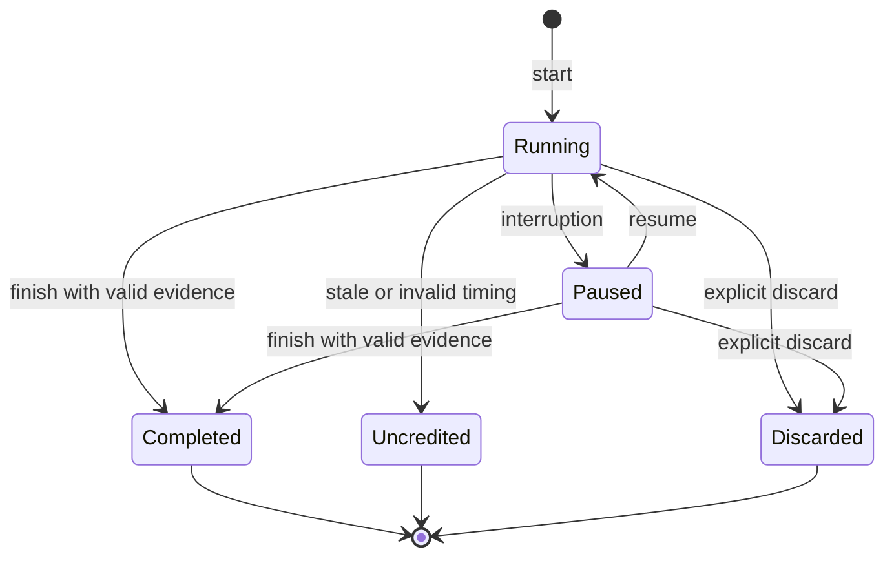
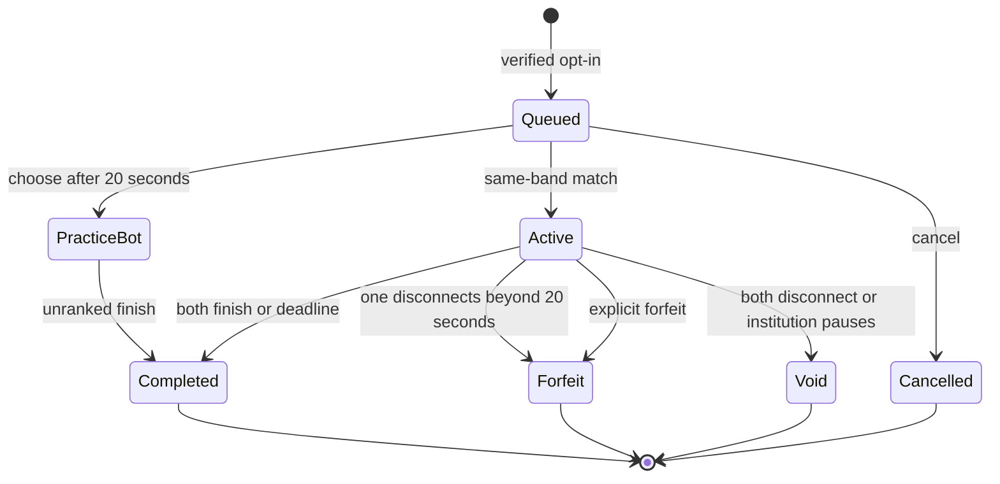
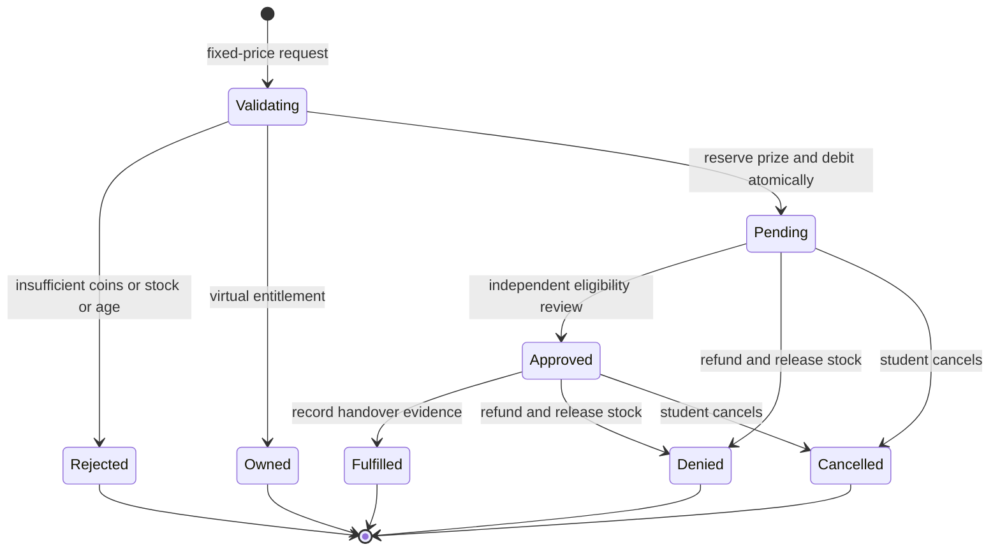

# Study Arena — Part 3: API and state machines

## API conventions

The route table below is generated from the same registry that serves requests. JSON bodies only; UTF-8; API prefix `/api`. Timestamps are UTC Unix seconds, not milliseconds. UUIDs are preferred for client activity IDs; seeded content has readable IDs. All successful mutations return HTTP 200, including safe replays. No operation returns an invented success while waiting for an external payout.

`public` accepts an optional bearer token to include the caller's accessible content. `student` means any authenticated, non-suspended user, acting on their own resources. `moderator` means teacher or administrator; cohort and object checks still apply. `admin` means administrator only. Role checks never replace object authorization.

Every row with **key required** needs `Idempotency-Key: <16–100 alphanumeric, underscore or hyphen characters>`. Generate one UUID before the first attempt, persist it, and reuse it on retry. Do not create a new key after an uncertain timeout. The key is scoped to the account and bound to method, path and body. Recent authentication means a successful login within the last 10 minutes; no password is asked from a room peer.

Pagination defaults to 30, maximum 100, with nonnegative `offset`. A saved deck fetches pages until `total` is reached. File downloads use byte offsets, 256 KB chunks, a final checksum, and a complete flag. Upload JSON is capped below the 2 MB request limit; file limit is 10 MB.

`?` on a field marks optional input. Record response names resolve to the columns/types in `Database_Dictionary.md` with the privacy projections listed after the table. Standard GET caches are client-encrypted; admin/export requests never enter the offline API cache.

### Endpoint surface

| Method and endpoint | Authorization / retry | Request or query shape | Success response shape | Specific errors, in addition to common errors |
|---|---|---|---|---|

| `POST /api/auth/register` | public; no key required | `{email,password,school_id,display_name,age_band,consent_ref?}` | `{message}` | VALIDATION,REGISTRATION_UNAVAILABLE,CONSENT_REQUIRED |
| `POST /api/auth/login` | public; no key required | `{email,password,device?}` | `{token,expires,user}` | INVALID_CREDENTIALS |
| `POST /api/auth/verify` | public; no key required | `{token}` | `{message}` | TOKEN_INVALID |
| `POST /api/auth/reset-request` | public; no key required | `{email}` | `{message}` | RATE_LIMITED |
| `POST /api/auth/reset` | public; no key required | `{token,password}` | `{message}` | TOKEN_INVALID,VALIDATION |
| `POST /api/auth/resend` | student; key required | `{}` | `{message}` | RATE_LIMITED |
| `POST /api/auth/logout` | student; no key required | `{}` | `{ok}` | — |
| `GET /api/me` | student; no key required | `—` | `{user}` | — |
| `PUT /api/me` | student; key required | `{version,display_name,course,year,subjects[],timezone,daily_goal,weekly_goal,competition}` | `{user}` | VERSION_CONFLICT,VALIDATION |
| `GET /api/me/devices` | student; no key required | `—` | `{items:[{id,device,created,expires,current}]}` | — |
| `DELETE /api/me/devices/{id}` | student; key required | `{}` | `{ok}` | — |
| `GET /api/me/export` | student; no key required | `—` | `{profile,sessions,attempts,answers,reviews,decks,cards,materials,memberships,inventory,ledger,claims,evidence,settings,badges,streak_days}` | REAUTH_REQUIRED |
| `POST /api/me/delete` | student; no key required | `{confirm:'DELETE'}` | `{message,delete_after}` | REAUTH_REQUIRED,ACTIVE_ROOM,PENDING_CLAIM |
| `GET /api/topics` | public; no key required | `—` | `{items:[Topic]}` | — |
| `GET /api/decks` | public; no key required | `?q=&topic=&offset=&limit=` | `{items:[Deck]}` | — |
| `GET /api/decks/{id}` | public; no key required | `?offset=&limit=` | `{deck,cards:[Card],total}` | NOT_FOUND |
| `POST /api/decks` | student; key required | `{title,topic_id,cards:[{front,back,image_id?,image_alt?}],source?,license?}` | `{deck}` | VALIDATION,DUPLICATE_CARD |
| `PUT /api/decks/{id}` | student; key required | `{version,title,topic_id,cards:[Card],source?,license?,allow_duplicates?}` | `{deck,conflict_copy?}` | FORBIDDEN,VALIDATION |
| `DELETE /api/decks/{id}` | student; key required | `{}` | `{ok}` | FORBIDDEN |
| `POST /api/decks/{id}/share` | student; key required | `{visibility:'public'\|'room'\|'private',room_id?,source,license}` | `{deck}` | FORBIDDEN,VALIDATION |
| `POST /api/decks/{id}/clone` | student; key required | `{}` | `{deck}` | NOT_FOUND |
| `POST /api/import/preview` | student; no key required | `{text,delimiter:','\|'tab'}` | `{valid:[{front,back,row}],errors:[{row,message}],duplicates:[number]}` | VALIDATION |
| `GET /api/quizzes` | public; no key required | `?q=&topic=&offset=&limit=` | `{items:[Quiz]}` | — |
| `GET /api/quizzes/{id}` | public; no key required | `—` | `{quiz,questions:[Question with accepted answers and explanation]}` | NOT_FOUND |
| `POST /api/quizzes` | moderator; key required | `{title,topic_id,duration?,source,license,questions:[{kind,prompt,options[],accepted[],explanation,topic_id?}]}` | `{quiz}` | VALIDATION |
| `GET /api/materials` | public; no key required | `?q=&course=&subject=&year=&file_type=&offset=&limit=` | `{items:[Material metadata]}` | — |
| `POST /api/materials` | student; key required | `{title,topic_id,year,body,source,license}` | `{material}` | VALIDATION |
| `POST /api/materials/{id}/file` | student; key required | `{offset,base64,complete:boolean,sha256,file_type:'pdf'\|'png'\|'jpeg'}` | `{offset,complete}` | VALIDATION,UPLOAD_OFFSET,CHECKSUM_MISMATCH,QUOTA |
| `GET /api/materials/{id}` | public; no key required | `?offset=byte offset` | `{material,base64?,offset?,next_offset?,complete?}` | NOT_FOUND |
| `GET /api/shop` | student; no key required | `—` | `{items:[CatalogItem],inventory,claims,wallet}` | — |
| `POST /api/shop/{id}/purchase` | student; key required | `{rules_version?}` | `{inventory?\|claim?,wallet}` | INSUFFICIENT_FUNDS,OUT_OF_STOCK,AGE_RESTRICTED,EMAIL_UNVERIFIED,RULES_CHANGED,ALREADY_CLAIMED |
| `POST /api/inventory/{id}/equip` | student; key required | `{}` | `{ok}` | NOT_OWNED,INVALID_ITEM |
| `POST /api/inventory/{id}/freeze` | student; key required | `{}` | `{ok,day}` | INVALID_ITEM,ALREADY_PROTECTED |
| `POST /api/claims/{id}/cancel` | student; key required | `{}` | `{claim,wallet}` | INVALID_STATE |
| `GET /api/notifications` | student; no key required | `—` | `{items:[Notification],settings}` | — |
| `PUT /api/notifications/settings` | student; key required | `{reminders,streak,invitations,challenges,rewards,quiet_start,quiet_end,reminder_time,daily_cap}` | `{settings}` | VALIDATION |
| `POST /api/notifications/{id}/read` | student; key required | `{}` | `{ok}` | — |
| `GET /api/wallet` | student; no key required | `?offset=&limit=` | `{wallet,ledger:[LedgerEntry]}` | — |
| `GET /api/study/sessions` | student; no key required | `?offset=&limit=` | `{items:[StudySession with own notes]}` | — |
| `POST /api/study/sessions` | student; key required | `{topic_id,notes?}` | `{session}` | ACTIVE_SESSION |
| `PUT /api/study/sessions/{id}` | student; key required | `{action:'heartbeat'\|'pause'\|'resume'\|'complete'\|'discard',notes?}` | `{session,wallet}` | INVALID_STATE |
| `POST /api/study/offline` | student; key required | `{id,topic_id,started,ended,elapsed,timezone,notes}` | `{session,wallet}` | VALIDATION,SESSION_CONFLICT |
| `POST /api/cards/{id}/review` | student; key required | `{known:boolean,occurred?}` | `{schedule,rewarded,wallet}` | VALIDATION,NOT_FOUND |
| `POST /api/quizzes/{id}/attempts` | student; key required | `{timed:boolean}` | `{attempt,questions}` | EMPTY_QUIZ |
| `GET /api/attempts/{id}` | student; no key required | `—` | `{attempt,questions,answers}` | NOT_FOUND |
| `POST /api/attempts/{id}/answer` | student; key required | `{question_id,answer}` | `{correct,accepted,explanation,late}` | INVALID_STATE,QUESTION_NOT_FOUND |
| `POST /api/attempts/{id}/finish` | student; key required | `{discard?:boolean}` | `{attempt,questions,answers,wallet}` | — |
| `POST /api/quizzes/{id}/offline` | student; key required | `{id,version,started,ended,timed,answers:[{question_id,answer,elapsed}]}` | `{attempt,questions,answers,wallet}` | CONTENT_CHANGED,VALIDATION |
| `GET /api/progress` | student; no key required | `—` | `{topics:[{mastery,evidence_count,label,confidence,suggested_minutes}],history,wallet,streak,today_minutes,week_minutes,badges,levels_enabled}` | — |
| `GET /api/rooms` | student; no key required | `?topic=&offset=&limit=` | `{mine,matching}` | FEATURE_DISABLED |
| `POST /api/rooms` | student; key required | `{title,topic_id}` | `{room,code}` | VALIDATION,FEATURE_DISABLED |
| `POST /api/rooms/join` | student; key required | `{code?\|room_id?}` | `{room}` | INVALID_INVITE,ROOM_FULL,SKILL_BAND_MISMATCH |
| `GET /api/rooms/{id}` | student; no key required | `—` | `{room,roster,messages,resources}` | NOT_FOUND |
| `PUT /api/rooms/{id}` | student; key required | `{action:'schedule'\|'timer'\|'rotate'\|'transfer'\|'remove'\|'disband'\|'restore',scheduled?,minutes?,user_id?}` | `{room?,code?,ok?}` | FORBIDDEN,INVALID_STATE |
| `POST /api/rooms/{id}/leave` | student; key required | `{}` | `{ok}` | OWNER_TRANSFER_REQUIRED |
| `POST /api/rooms/{id}/messages` | student; key required | `{body}` | `{message,support?}` | RATE_LIMITED,NOT_FOUND |
| `POST /api/rooms/{id}/resources` | student; key required | `{kind:'deck'\|'material',resource_id}` | `{ok}` | NOT_FOUND |
| `POST /api/users/{id}/block` | student; key required | `{blocked:boolean}` | `{ok}` | VALIDATION |
| `POST /api/duels/queue` | student; key required | `{topic_id,bot?:boolean}` | `{duel?\|queued,wait_seconds?}` | COMPETITION_HIDDEN,EMAIL_UNVERIFIED,ACTIVE_DUEL,COOLDOWN |
| `GET /api/duels/current` | student; no key required | `—` | `{duel,questions,answers?,result?}\|{queued,wait_seconds}` | COMPETITION_HIDDEN,EMAIL_UNVERIFIED |
| `DELETE /api/duels/queue` | student; key required | `{}` | `{ok}` | — |
| `GET /api/duels/{id}` | student; no key required | `—` | `{duel,questions,answers?,result?}` | NOT_FOUND |
| `POST /api/duels/{id}/answer` | student; key required | `{question_id,answer}` | `{accepted,duel}` | INVALID_STATE,DEADLINE_EXPIRED |
| `POST /api/duels/{id}/forfeit` | student; key required | `{}` | `{duel}` | — |
| `POST /api/reports` | student; key required | `{kind,target_id,reason}` | `{report}` | NOT_FOUND,RATE_LIMITED |
| `GET /api/reports` | student; no key required | `—` | `{items:[own reports]}` | — |
| `GET /api/admin` | moderator; no key required | `—` | `{content_queue,reports,aggregate,flags?,users?,claims?,catalog?,ledger?,audit?,risk?}` | FORBIDDEN |
| `GET /api/admin/content/{kind}/{id}` | moderator; no key required | `—` | `{item,cards?\|questions?}` | FORBIDDEN |
| `POST /api/admin/content/{kind}/{id}` | moderator; key required | `{status:'approved'\|'quarantined',reason}` | `{ok}` | FORBIDDEN,SELF_APPROVAL,EMPTY_CONTENT |
| `POST /api/admin/reports/{id}` | moderator; key required | `{action:'dismiss'\|'hide'\|'warn',reason}` | `{ok}` | FORBIDDEN |
| `PUT /api/admin/flags/{id}` | admin; key required | `{enabled:boolean,reason}` | `{flag}` | REAUTH_REQUIRED,POLICY_REQUIRED |
| `POST /api/admin/users/{id}` | admin; key required | `{action:'warn'\|'suspend'\|'restore'\|'reset_band'\|'role'\|'consent',reason,role?,band?,consent_ref?}` | `{ok}` | VALIDATION,SELF_ACTION |
| `POST /api/admin/cohorts` | admin; key required | `{cohort_id,title,user_id,moderator:boolean,reason}` | `{ok}` | VALIDATION |
| `POST /api/admin/catalog` | admin; key required | `{title,kind,price,stock?,adult_only,rules,rules_version,sponsor,value,reason}` | `{item}` | VALIDATION |
| `PUT /api/admin/catalog/{id}` | admin; key required | `{stock,active,reason}` | `{item}` | VALIDATION |
| `POST /api/admin/claims/{id}` | admin; key required | `{action:'approve'\|'deny'\|'fulfill',reason,eligibility_ref?,receipt?}` | `{claim}` | INVALID_STATE,ELIGIBILITY_REQUIRED,SELF_APPROVAL |
| `POST /api/admin/ledger` | admin; key required | `{user_id,xp,coins,reason,origin}` | `{wallet}` | NEGATIVE_BALANCE |
| `POST /api/push/register` | student; key required | `{token,platform:android}` | `{ok}` | VALIDATION |
| `GET /api/health` | public; no key required | `—` | `{status,demo,server_time}` | — |
| `GET /api/config` | public; no key required | `—` | `{flags,earning_rules,support,api_origin}` | — |
| `GET /api/contracts` | public; no key required | `—` | `{endpoints:[EndpointContract]}` | — |

### Error envelope and common errors

Every error is `{ "error": { "code": "CODE", "message": "Human-readable reason", "request_id": "UUID" } }`. A retry must retain the activity key. Field-validation failures preserve the local form; authentication failures preserve saved study work. Unknown server failures contain a request ID and no stack trace or private fields.

| Error code | HTTP status | Client behavior |
|---|---|---|
| `ACTIVE_ROOM` | 409 | Correct the input or show the domain message; do not blindly retry. |
| `ACTIVE_SESSION` | 409 | Correct the input or show the domain message; do not blindly retry. |
| `AGE_RESTRICTED` | 403 | Correct the input or show the domain message; do not blindly retry. |
| `ALREADY_CLAIMED` | 409 | Correct the input or show the domain message; do not blindly retry. |
| `ALREADY_PROTECTED` | 409 | Correct the input or show the domain message; do not blindly retry. |
| `AUTH_REQUIRED` | 401 | Sign in again; retain the encrypted local workspace and queue. |
| `BODY_TOO_LARGE` | 413 | Correct the input or show the domain message; do not blindly retry. |
| `CHECKSUM_MISMATCH` | 422 | Correct the input or show the domain message; do not blindly retry. |
| `COMPETITION_HIDDEN` | 403 | Correct the input or show the domain message; do not blindly retry. |
| `CONFIGURATION` | 500 | Correct the input or show the domain message; do not blindly retry. |
| `CONSENT_REQUIRED` | 403 | Correct the input or show the domain message; do not blindly retry. |
| `CONTENT_CHANGED` | 409 | Keep the local version, show conflict, reload current content or preserve a conflict copy. |
| `CONTENT_LOCKED` | 403, 409 | Correct the input or show the domain message; do not blindly retry. |
| `CONTENT_TYPE` | 415 | Correct the input or show the domain message; do not blindly retry. |
| `COOLDOWN` | 409 | Correct the input or show the domain message; do not blindly retry. |
| `DEADLINE_EXPIRED` | 409 | Correct the input or show the domain message; do not blindly retry. |
| `DUPLICATE_CARD` | 422 | Correct the input or show the domain message; do not blindly retry. |
| `ELIGIBILITY_REQUIRED` | 403 | Correct the input or show the domain message; do not blindly retry. |
| `EMAIL_UNVERIFIED` | 403 | Correct the input or show the domain message; do not blindly retry. |
| `EMPTY_CONTENT` | 409 | Correct the input or show the domain message; do not blindly retry. |
| `EMPTY_QUIZ` | 409 | Correct the input or show the domain message; do not blindly retry. |
| `FEATURE_DISABLED` | 403 | Correct the input or show the domain message; do not blindly retry. |
| `FILE_UNAVAILABLE` | 404 | Correct the input or show the domain message; do not blindly retry. |
| `FORBIDDEN` | 403 | Correct the input or show the domain message; do not blindly retry. |
| `IDEMPOTENCY_CONFLICT` | 409 | Investigate key reuse; do not silently change keys for an uncertain committed operation. |
| `IDEMPOTENCY_REQUIRED` | 400 | Correct the input or show the domain message; do not blindly retry. |
| `INSUFFICIENT_FUNDS` | 409 | Correct the input or show the domain message; do not blindly retry. |
| `INTERNAL_ERROR` | 500 | Keep work and retry with the same key; give support the request ID. |
| `INVALID_CREDENTIALS` | 401 | Sign in again; retain the encrypted local workspace and queue. |
| `INVALID_INVITE` | 404 | Correct the input or show the domain message; do not blindly retry. |
| `INVALID_ITEM` | 422 | Correct the input or show the domain message; do not blindly retry. |
| `INVALID_JSON` | 400 | Correct the input or show the domain message; do not blindly retry. |
| `INVALID_STATE` | 409 | Correct the input or show the domain message; do not blindly retry. |
| `METHOD_NOT_ALLOWED` | 405 | Correct the input or show the domain message; do not blindly retry. |
| `NEGATIVE_BALANCE` | 409 | Correct the input or show the domain message; do not blindly retry. |
| `NOT_FOUND` | 404 | Correct the input or show the domain message; do not blindly retry. |
| `ORIGIN_DENIED` | 403 | Correct the input or show the domain message; do not blindly retry. |
| `OUT_OF_STOCK` | 409 | Correct the input or show the domain message; do not blindly retry. |
| `OWNER_TRANSFER_REQUIRED` | 409 | Correct the input or show the domain message; do not blindly retry. |
| `PENDING_CLAIM` | 409 | Correct the input or show the domain message; do not blindly retry. |
| `POLICY_REQUIRED` | 403 | Correct the input or show the domain message; do not blindly retry. |
| `PUSH_PROVIDER` | 503 | Keep work and retry with the same key; give support the request ID. |
| `QUESTION_NOT_FOUND` | 404 | Correct the input or show the domain message; do not blindly retry. |
| `QUOTA` | 413 | Correct the input or show the domain message; do not blindly retry. |
| `RATE_LIMITED` | 429 | Back off; keep the same operation key and form contents. |
| `REAUTH_REQUIRED` | 401 | Sign in again; retain the encrypted local workspace and queue. |
| `REGISTRATION_UNAVAILABLE` | 409 | Correct the input or show the domain message; do not blindly retry. |
| `ROOM_FULL` | 409 | Correct the input or show the domain message; do not blindly retry. |
| `RULES_CHANGED` | 409 | Correct the input or show the domain message; do not blindly retry. |
| `SELF_ACTION` | 409 | Correct the input or show the domain message; do not blindly retry. |
| `SELF_APPROVAL` | 403 | Correct the input or show the domain message; do not blindly retry. |
| `SKILL_BAND_MISMATCH` | 409 | Correct the input or show the domain message; do not blindly retry. |
| `SMTP_CONFIGURATION` | 500 | Correct the input or show the domain message; do not blindly retry. |
| `TOKEN_INVALID` | 400 | Correct the input or show the domain message; do not blindly retry. |
| `UPLOAD_OFFSET` | 409 | Correct the input or show the domain message; do not blindly retry. |
| `VALIDATION` | 422 | Correct the input or show the domain message; do not blindly retry. |
| `VERSION_CONFLICT` | 409 | Keep the local version, show conflict, reload current content or preserve a conflict copy. |

### Response projections

- `User`: `users` columns except `password_hash`, `school_hash`, `school_cipher`, `consent_ref`; subjects is a JSON array. Server data export can include a separately decrypted school ID, never the password hash or bearer credentials.
- `StudySession`: never returns `notes_cipher`. The owner's history/export includes decrypted `notes`; write responses return the timing/credit state. Other users and teacher analytics cannot access this record.
- `Deck`: deck metadata plus optional `card_count`; detail includes paginated cards and due schedule values for the requester. Public listing includes approved public decks and the owner's own decks.
- `Question`: `options` and `accepted` are arrays, not JSON strings. Solo quiz packages intentionally include accepted answers and explanations. Active duel projection strips both.
- `Attempt`: metadata plus the immutable question snapshot rendered as `questions` and the user's `answers`; raw `snapshot` TEXT is not duplicated in the response.
- `Material`: metadata and permitted body or verified binary chunks. List responses exclude full text bodies. Content entitlements are checked before material access.
- `Room`: no invitation hash is exposed. Creation/rotation returns the new plaintext code once. Roster contains display name, private-room band and join time; not email or school ID.
- `Duel`: player IDs are scoped to authenticated participants; public identity is the chosen display name. During play only the requester's submitted answers are returned, without correctness; after settlement the solutions are disclosed. Neither competitor receives the other's private study logs.
- `Wallet`: XP, coins, level, next-level XP and listed unlock thresholds. The level display is separately feature-flagged. Ledger adjustments are signed integers; resulting balances cannot be negative.
- `Admin`: teachers receive assigned content/report queues and cohort aggregates only. Administrators additionally receive access-management projections, flags, claims, catalog, ledger, audit and review signals. Neither receives a generic private-study-log endpoint.

### Non-idempotent and transient boundaries

Registration uses unique email/school identifiers. Login returns a new opaque session; the UI does not repeatedly retry a failed credential response. Reset/verification tokens are one-time and expire. GET `/duels/current` is an explicitly documented heartbeat/poll operation: it updates presence and may complete matchmaking/settlement even though it returns a view. File chunk writes live on a filesystem outside SQLite; an unknown file-upload timeout is resolved by inspecting the offset before continuing. Do not treat a filesystem write as a database transaction.

## Study-session state machine

A connected session has server heartbeat evidence; heartbeat deltas cap at 120 seconds. The mobile web timer is local-first and submits one immutable completion. An offline log with less than five minutes or an overlap is `uncredited`. Invalid clock evidence is rejected for review and retained locally. Credited duration cannot exceed 180 minutes. The client pauses after four wall-clock hours or a large/negative clock jump. Notes survive interruptions and remain private.

A completion retry returns its previous result. A second device cannot run a second credited connected session. Offline overlap resolution uses first server acceptance; no app can prove simultaneous offline activity without a trusted witness.

## Duel state machine

Queue status is held in `duel_queue`; only active/settled rounds live in `duels`. The pilot uses exactly the same skill band, does not widen automatically, and exposes a labeled unranked bot after 20 seconds. The fixed 92-second deadline includes a two-second transport allowance for everyone. Late answers cannot add points. An operation retry cannot insert the same answer twice. Once a result is conclusive it is not changed because a client later disconnects. No exclusive XP or prize is earned by competing.

The question generator has three explicitly supported pilot topics: linear equations, elementary differentiation and binary conversion. It does not pretend to provide a comprehensive competitive question bank. Skill band is derived from learning evidence and cannot be lowered by repeatedly forfeiting. Queue entry is rate-limited to limit rematch spam; blocked peers are excluded.

Season membership is captured at duel creation. Season expiry never erases mastery, personal history, inventory or XP. Seasonal peer rankings and tournaments are deferred and have no live endpoints in this release.

## Reward redemption state machine

Validation and the debit/reservation are one transaction. Owning a nonconsumable returns the entitlement without another debit. A consumed freeze can be purchased again. One claim is allowed per account per prize offer; a new school offer gets a new catalog ID. Denial/cancellation appends a compensating entry and restores reserved stock exactly once. Fulfillment requires prior approval and a receipt reference. An administrator cannot approve their own prize claim. No cash transfer, payment entry or chance-based mechanic exists.

## Deferred API design, explicitly not live

A future tournament release adds `POST /tournaments`, `POST /tournaments/{id}/entries`, `POST /tournaments/{id}/start`, `GET /tournaments/{id}` and cancellation under room-owner authorization. Fields and uniqueness are in `Deferred_Extensions.sql`. Tournament entry requires consent and the same band; 2–8 participants; void rounds do not award points. A future `GET /rooms/{id}/standings?season=...` requires room membership and individual comparison opt-in and returns only chosen display names, cosmetics and seasonal points. These endpoints are specifications, not placeholder handlers.
