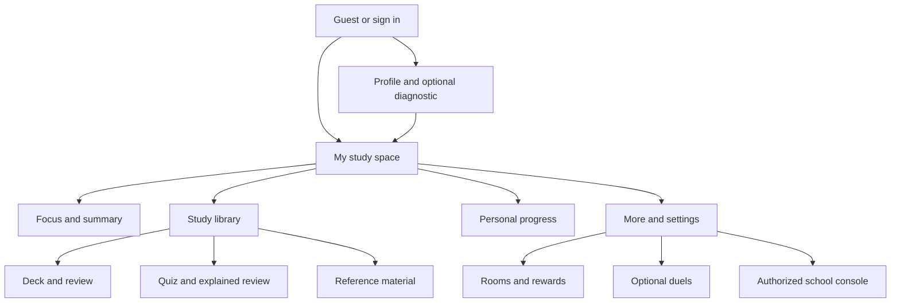

# Study Arena — Part 4: Screen-by-screen UI specification

## 1. Visual and interaction system

The interface is deliberately calm. It uses warm off-white surfaces, dark green text, sage actions, restrained peach accents, spacious cards and an original book/plant illustration. System fonts keep the app small and avoid font downloads. Dark mode uses the same hierarchy. The dashboard does not present rank, rivals or a duel invitation as the primary action.

Design tokens live in `web/tokens.css`; responsive layout and focus states in `web/style.css`. Desktop has a persistent left navigation. Small screens have Home, Focus, Library, Progress and More in a bottom navigation. More exposes rewards, permitted rooms, optional duels, profile and privacy. Cards stack rather than compress essential controls. The intended minimum viewport is 320 CSS pixels, with testing at 360 pixels and 200% text.

The companion layer uses eight transparent character sprites derived from the team's hand-drawn concept. Moss is available initially; the other seven can be unlocked without coins and selected from Rewards. The selected companion and its normalized screen position are stored in the encrypted device workspace. It appears in the profile and can be dragged within the viewport by mouse or touch; arrow keys provide precise movement, Shift+Arrow moves farther, and Home resets the default corner. Every character has distinct language and a movement set drawn from breathing, walking, running, hopping, hovering, spinning, shaking, swaying and wiggling. Short, non-blocking reactions accompany selected review, quiz, focus and customization events. Motion is decorative, never required to understand feedback, and is disabled by the operating system's reduced-motion preference.

Default primary controls have a minimum 46-pixel touch height. Labels are programmatically associated with inputs. Native buttons, links, forms, checkboxes, progress elements and dialogs provide keyboard/screen-reader semantics. Decorative SVGs are hidden from assistive technology; informative illustrations have an accessible name. Color is always paired with text (e.g. “Needs review”, “Correct”, “Pending sync”). No flashing, confetti requirement, shame message or public failure callout appears.

## 2. Shared state language

- **Loading:** text with `aria-busy`, then actual data; never fabricated statistics. Cached study data may appear with an offline label.
- **Success:** short, nonblocking status message, persisted before navigation. Destructive actions require a distinct confirmation.
- **Empty:** explain what is absent, then give the relevant next action. No evidence is “Not assessed”, never “0% mastery”.
- **Error:** display the server's domain message in an alert region, keep inputs/local work, offer retry. Expired login preserves the encrypted workspace.
- **Offline:** cached studying stays enabled; connected actions explain their requirement. Pending operations are visible in Settings. Admin data is not cached.
- **Permission denied:** give a concise reason and a safe return path. Do not show a disabled private record's contents behind a warning.

## 3. Navigation

Only permission-eligible navigation is rendered. Switching competition off clears a queued round and removes challenges; the API also rejects new competition requests. Levels can disappear without removing mastery, coins, inventory or library tools.

## 4. Complete screen inventory and states

| ID / screen | Happy path and primary action | Empty state | Error / permission state | Offline behavior |
|---|---|---|---|---|
| A01 Guest home | Browse original starter decks/notes; try one quiz | First visit offers short study content | Unavailable public resource has a retry | Bundled starter content and shell open after installation |
| A02 Sign in / unlock | Email/password opens encrypted workspace; then home | Invite registration or guest exploration | Invalid credentials keep email; wrong local key explains recovery | Previously prepared workspace can unlock without server |
| A03 Register | Name, email, school ID, password, age band, consent, privacy assent | Clear labeled fields | Duplicate identity, weak input and missing institutional consent rejected | Registration requires internet |
| A04 Verify email | Follow one-time link; confirmation then login | Resend link from Settings | Expired/used token explained | Link verification requires internet |
| A05 Password recovery | Generic response, reset link, new password | Enter email; dead-inbox institutional route explained | Token error or unavailable inbox retains recovery guidance | Requires connection; local cache remains unlockable with its original password |
| A06 Profile / subjects | Choose course/year/subjects, timezone and student-set goals | Reasonable defaults; no assumed competition | Invalid timezone or version conflict asks for correction/reload | Read cached profile; profile mutation requires sync-ready connection |
| A07 Diagnostic choice | Try three explained questions or skip | Skip is equally prominent | Unavailable quiz returns to library | Saved diagnostic can run offline; band becomes canonical after sync |
| A08 Competition preference | Explicit checkbox, off initially | No competitive surfaces | Unverified account is blocked at entry | Cached preference applies; new matches require connection |
| B01 Home | Start focus; browse content; see own goals/streak/coins | First-study recommendations and no fake mastery | Cached progress timestamp/offline label; retry failed reads | Cached dashboard plus offline content access |
| B02 Focus setup | Subject, duration preset, private note; Begin | Default 25 minutes; optional notes | Invalid note/input retained | Fully local start and persistence |
| B03 Active focus | Large timer; pause/resume/finish; notes | Not applicable | Clock anomaly pauses; long gap explained | Five-second checkpoints, app background persistence; credit pending until sync |
| B04 Session summary | Minutes, subject and notes; Home/Progress | Short session explicitly uncredited | Sync failure does not erase summary | Stored locally and queued |
| B05 Goals / history | Edit own goals; inspect personal sessions | Invite first focus session | No other user's logs; auth preserves cache | Last synced history plus local pending status |
| C01 Deck list | Browse/search; Create deck; open card count | Add or import first deck | Search retry / visibility enforcement | Saved own/downloaded decks accessible |
| C02 Deck detail | Review due or shuffle practice; offline save | Empty deck explains add/import | Missing/unshared deck returns unavailable | Entire saved deck usable; clone/share needs connection |
| C03 Deck editor | Title/topic; front/back pairs; 20 cards per page | One blank card starter | 500-card and 4,000-character limits; duplicate confirmation | Editing/saving uses encrypted local draft and queue |
| C04 Import preview | Select CSV/paste; show valid/invalid/duplicate rows; confirm valid only | Paste instructions and two-column format | Malformed rows identify row numbers; no implicit partial import | Local CSV preview works without connection; valid rows are only added after confirmation |
| C05 Card review | Recall, flip, Known/Needs review; due scheduling | Nothing due offers ungraded practice | Failed image has supporting text and a load action | Reviews work and queue; provisional local due date |
| C06 Sharing / clone | Private/public/room with source and license; clone accessible deck | Private by default | Public waits moderation; room membership enforced | Sharing and uncached cloning require connection |
| D01 Quiz list | Browse explained quiz, save for offline | Adjacent subject/search suggestion | Invalid/unpublished quiz unavailable | Saved quiz list/packages available |
| D02 Quiz start / resume | Untimed/timed choice; resume saved cursor | New attempt explains question count | Changed server version preserves local record for conflict handling | Saved questions and explanations available |
| D03 Answer | MCQ buttons, true/false choices or labeled identification input | Empty identification input cannot submit | Late answer is unanswered; no fuzzy hidden grading | Each answer saves before next screen |
| D04 Feedback | Correct answer and explanation; Next | Not applicable | A grading conflict stays visible at sync | Explanations are bundled with saved solo quiz |
| D05 Final review / retake | Score, every answer/explanation, reshuffle retake | Unanswered questions explicitly shown | Suspicious timing may withhold reward, not local review | Finish queues once; guest result retained for registration |
| E01 Library filters | Course/subject/year/type/search | Clear filters and adjacent subjects | Retry failed query | Cache-only results labeled offline |
| E02 Material reader | Attribution, license, verification if checked, text or download | Missing optional note body explained | Copyright quarantine removes access; optional content lock points to shop | Saved notes and verified files available |
| E03 Download | Save bounded chunks, progress, checksum then open | No download yet offers Save | Low storage/checksum/version error keeps partial state or requests restart | Completed file opens; partial file cannot be presented as complete |
| E04 Contributor form | Notes or file, source, license; submit review | Clear original-work guidance | Oversize/unsupported file and missing attribution rejected | Draft remains in form; upload requires connection |
| E05 Report concern | Reason and target; status tracked in Settings | Explain evidence needed | Rate/permission errors; do not attach private notes | Connected report operation |
| F01 Weak areas / plan | Ranked topics, evidence count, confidence, suggested minutes | Not assessed and diagnostic invitation | Last known state retained; no invented recalculation | Last canonical result with pending-sync notice |
| F02 Personal history | Quiz results over time and own focus history | First-activity invitation | Other-user IDs are denied | Cached history, no public ranking fallback |
| G01 Room discovery | My rooms and same-band matching rooms | Create room or return solo | Feature-disabled/full/mismatch states | Downloaded material remains elsewhere; live list needs connection |
| G02 Create / join | Topic/title or expiring invite code | Explain 10-member cap | Generic bad invite, rate cap, skill mismatch | Requires connection |
| G03 Room detail | Roster, resources, timer, schedule, discussion | Quiet-room explanation | Removed members lose access; own timer remains | Shared downloaded content and own solo timer remain usable |
| G04 Owner controls | Rotate invite, schedule, transfer, remove, disband/restore | No schedule offers date/time | Self-removal requires transfer/disband; restore window enforced | Connected controls only |
| G05 Discussion | Labeled message form; block/report | Encourage a study question | Preserve draft on failure; hidden content disappears | Draft remains while on screen; cannot send offline |
| H01 Duel entry | Verified opt-in; choose supported topic | Explain optional and same-band rules | Unverified/global-off/own-off all block | Internet required; return solo |
| H02 Queue | Search timer, cancel, bot after 20 seconds | No opponent: continue or bot | Rate cap, no fake opponent | Disconnect retains no simulated live match |
| H03 Active duel | Server deadline, answer form, forfeit | Waiting after all answers | 20-second return window; fixed transport allowance | Reconnect or server-settled forfeit/void |
| H04 Duel result | Solutions after settlement; report or return solo | Void explained without invented winner | Conclusive result is stable | Last received result only; no new competitive action |
| I01 XP / badges / levels | Visible earning rules, earned badges; flag-gated levels | 0 XP without negative framing | Adjustments require reason; cap explained | Canonical wallet cached; pending activity separate |
| J01 Shop / inventory | Fixed price, stock, buy/equip; themes/skins/borders/hats | Attainable first cosmetic | Insufficient coins/owned/out-of-stock; no double charge | View cache, purchase/equip requires connection |
| J02 Freeze | Protect yesterday if not already studied/protected | Buy freeze through shop | Already protected or consumed item rejected | Requires connection |
| J03 Prize rules / claim | Read versioned rules, age/sponsor, submit; track state | Prizes hidden unless authorized | Minor restriction, stale rules, eligibility, stock | No offline reservation or fake fulfillment |
| K01 Notification preferences | Category controls, quiet hours, reminder time, cap | Defaults are optional | OS permission denial is respected | Android local scheduled reminders work; browser limitation is stated |
| K02 Inbox | Read allowed notifications, mark read | Quiet inbox | Delivery failure never blocks studying | Last cached inbox; new alerts after reconnect |
| L01 School dashboard | Cohort aggregate only; suppression below five | Zero vs suppressed is explicit | Role/cohort enforcement | No admin offline cache |
| L02 Moderation | Inspect source/content, approve or quarantine with reason | Caught-up state | No self-approval; recent login required | Connection required |
| L03 Reports | Inspect evidence; dismiss/hide/warn | No pending reports | Assigned cohort and target enforcement | Connection required |
| L04 Users / integrity | Reviewed warning, restriction, role/band change | No pending signals | No self-elevation; reason required | Connection required |
| L05 Rewards / audit | Claims, stock, independent review, receipts, ledger compensation | No claim or adjustment needed | Invalid state / negative balance rejected atomically | Connection required |
| L06 Cohorts / flags | Assign moderators; toggle validated pilots | Features remain hidden where off | Recent login and policy checks | Connection required |
| S01 Sync / cache | Pending count, Retry, local export, archive blocked operation | Everything synced | Conflict remains visible, no automatic deletion | Fully accessible inside unlocked workspace |
| S02 Devices | Current/other device list, revoke | Only current session | Revocation immediately blocks server access | Cached list only, revocation online |
| S03 Privacy / export / delete | Notice, machine-readable export, confirmed deletion | No destructive primary CTA | Active-room/pending-claim guard, recent auth | Local export works; server export/deletion require connection |

## 5. Responsive and accessibility acceptance

At 320–360 pixels the application uses one column, accessible form labels and the bottom navigation. Table-heavy administration uses a named horizontally scrollable region rather than shrinking text. At 200% text, card actions wrap. Long Filipino/Hiligaynon text wraps without clipping. Standard focus rings are visible. Dialogs use native modal focus behavior. Toasts use a status region; errors use an alert region. The timer itself does not announce every second.

Physical TalkBack testing, OS large-font settings, gesture navigation, low battery and Android process death remain device tests. Headless Chromium screenshots and DOM semantics are evidence about the web client, not a substitute for those OS checks.

## 6. Notifications and support wording

Suggested reminder: “Your quiet study moment — a few minutes with one topic is a good start.” Quiet hours suppress delivery; the cap is three notifications/day with one slot reserved when local reminders are enabled. Competition-off disables challenge notifications. No “you are falling behind your classmates” copy is used.

A high-risk distress phrase can surface a short message pointing to emergency services, a trusted person and the school guidance office. It does not diagnose, counsel or promise crisis monitoring. The institution must maintain its real safeguarding contacts and escalation process before public use. The app does not imply that its room chat is continuously monitored.

## 7. Contributor controls

Teachers author quizzes with labeled question, choice, accepted-answer and explanation fields. Changing the type to true/false fills the two standard choices; identification uses accepted answers without choices. Server validation checks every submitted item. Room members choose shared resources by title rather than copying internal identifiers. Moderation retains audit references for the school's review process.

## 8. Deferred screens

Tournament bracket, seasonal peer leaderboard, rich simultaneous deck collaboration and automated prize fulfillment do not appear in navigation. Their future entry conditions are in Part 3 and the deferred SQL appendix. Their absence must not be interpreted as a loss of solo progression.
